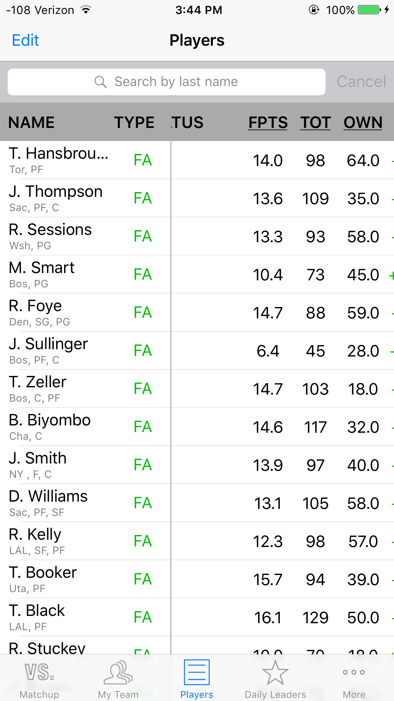

# FantasyBasketball_iOS
Accesses basketball player data from games.espn.com, rotoworld.com, and espn.com for the purpose of tracking NBA player fantasy performance

Utilizes:
  -Hpple
  -BEMLineGraph
  -MZFormViewController

###Player details view

###Player view

