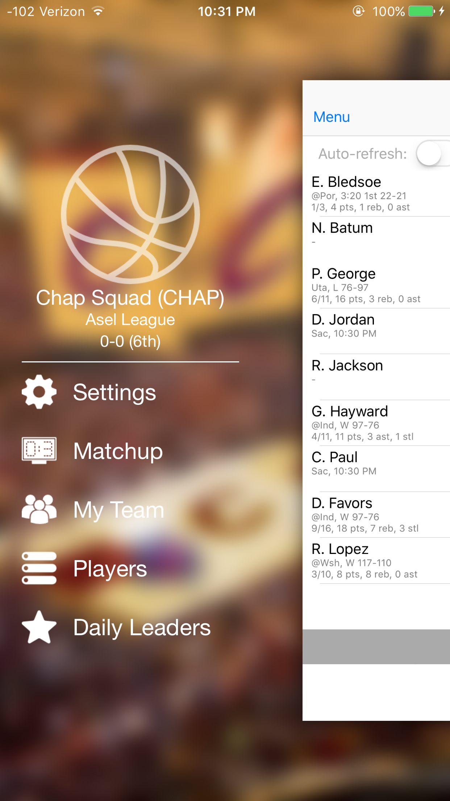
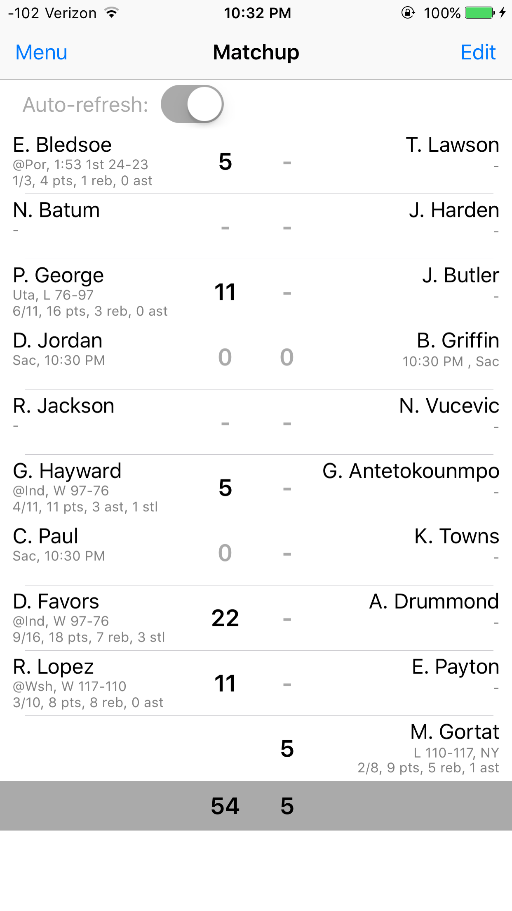
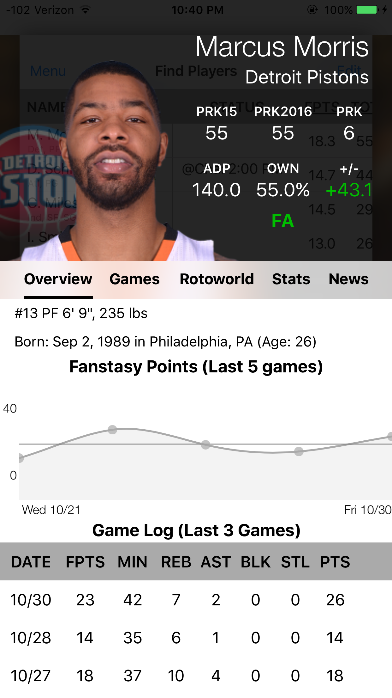
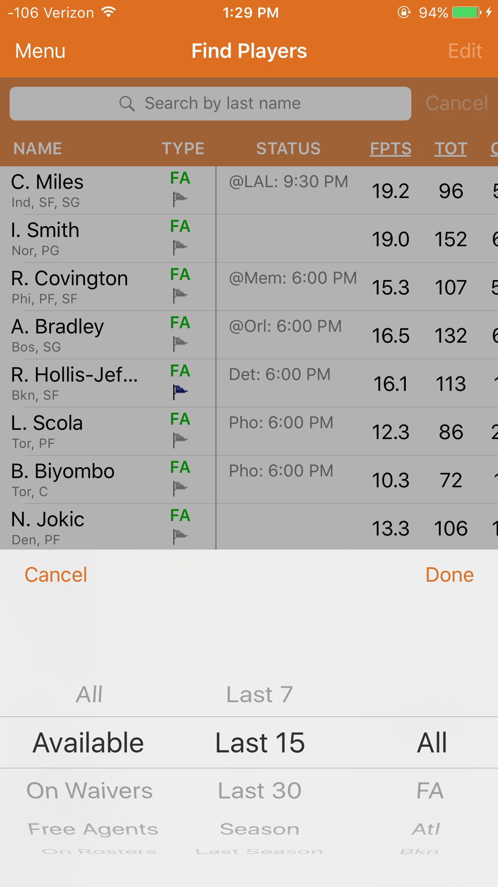
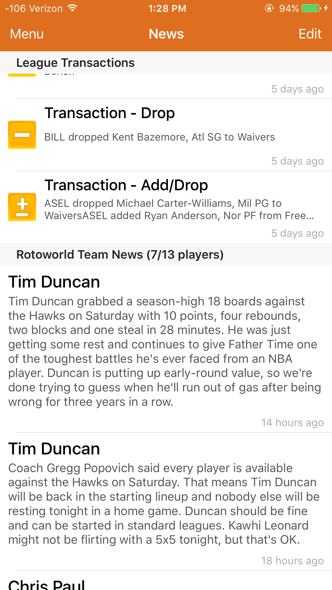
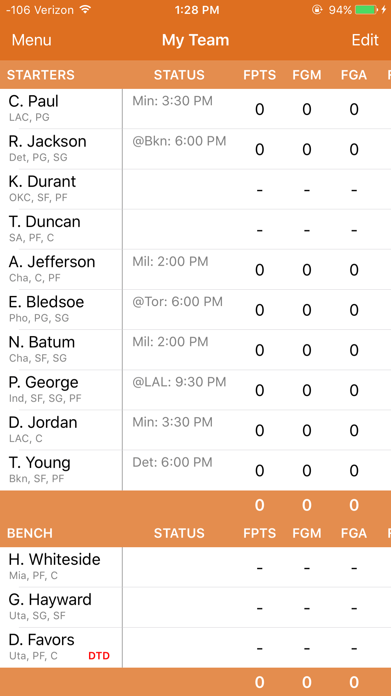
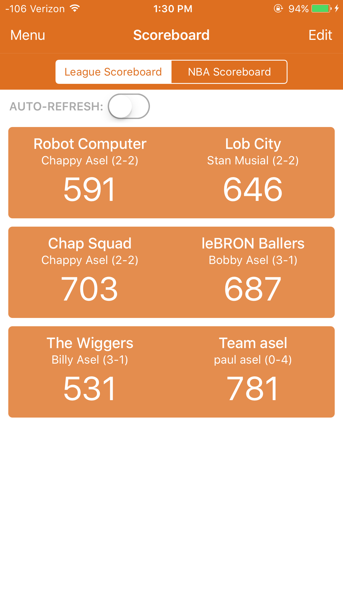
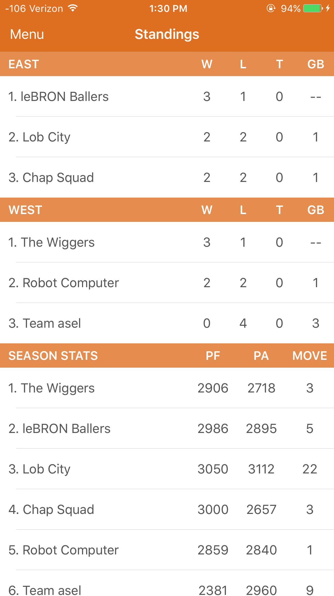

# FantasyBasketball_iOS
Accesses basketball player data from games.espn.com, rotoworld.com, espn.com, nba.com, and cbs.com for the purpose of tracking NBA player fantasy performance in detail.

To install: 
    Make sure you have CocoaPods installed on your computer (https://cocoapods.org) and that the pod is initialized in the FanstasyBasketball folder. When opening the project, make sure you open the .xcworkspace file and NOT the .xcodeproj file. Upon opening the project, 5 defualt fantasy teams (belonging to 2 leagues) and 1 watch list will be provided as a proof-of-concept. If you would like to track your own fantasy team, note that this app can only be used if your league is an ESPN fantasy basketball league with default "custom" scoring settings.

Utilizes:
  -Hpple
  -BEMLineGraph
  -ZFDragableModalTransition
  -RESideMenu
  -Core Data

###Side Menu

###Weekly Matchup view

###Player info view

###Players view

###News view

###My Team view

###Watch List view

###Scoreboard view

###Standings view
